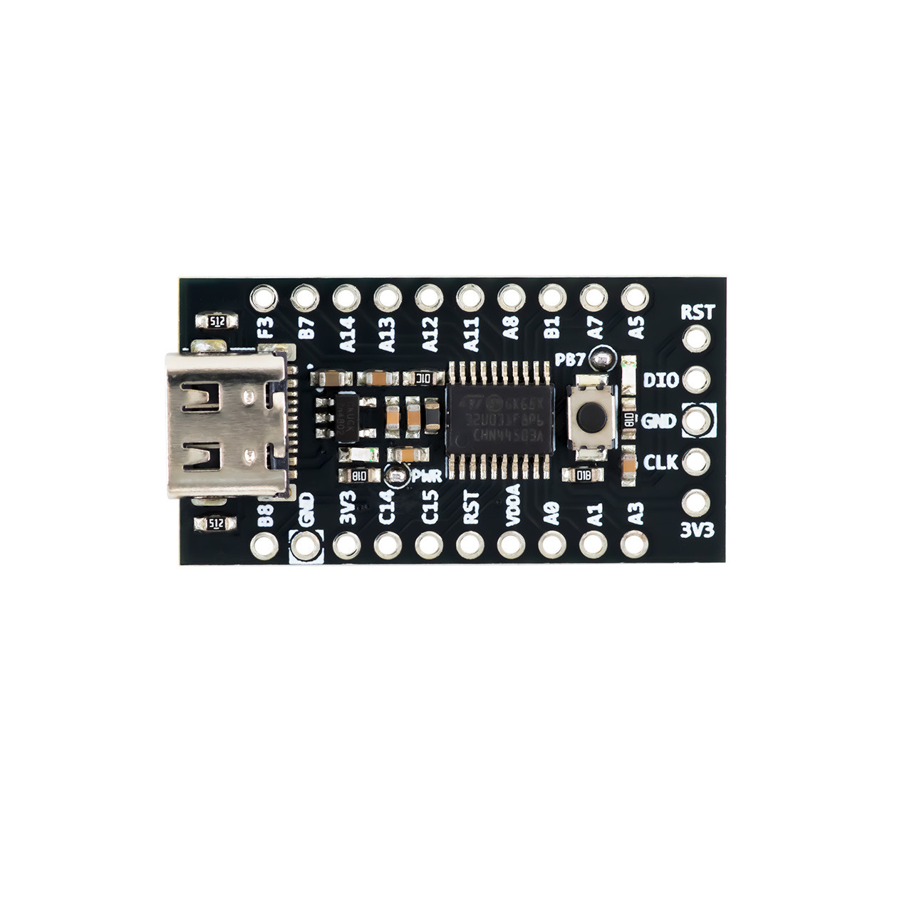
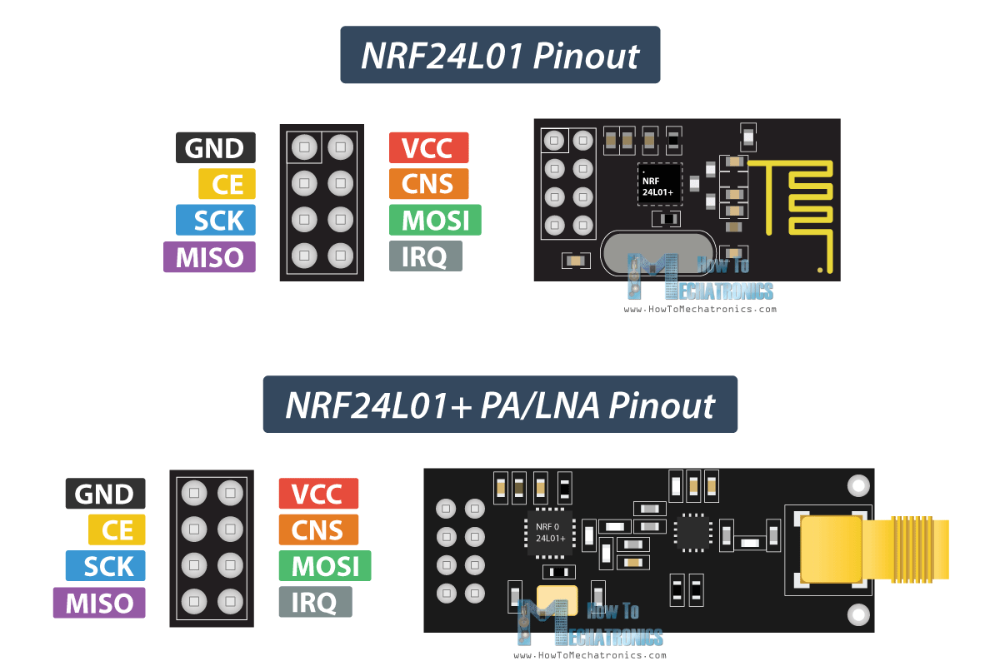

# Multi Modular Node

Two-board system: an STM32U031F8P6 **sensor node** (this repo) reads BMP280 +
MQ135 and transmits an aggregated telemetry packet over NRF24L01 to an ESP32
**gateway node**, which timestamps it with a DS3231 RTC and prints it to the
serial console. This README documents the pinout for both boards, how each
sensor/module driver works, which demo functions exist, and what's currently
active vs. wired-but-disabled.

## System architecture

```
 STM32 sensor node                                ESP32 gateway node
┌─────────────────────┐                          ┌─────────────────────┐
│ BMP280 (SPI2)        │                          │                     │
│ MQ135  (ADC1)        │──> TelemetryPacket_t ──> │ NRF24L01 (RF24 lib) │
│ W25Q64 flash (SPI2)  │    over NRF24L01,         │ DS3231 RTC (I2C)    │
│ NRF24L01 (SPI2)      │    channel 76,            │ -> Serial console   │
└─────────────────────┘    addr E7E7E7E7E7        └─────────────────────┘
```

- **Sensor node** (`Core/`, this STM32CubeIDE project): see
  [Sensor node — STM32U031F8P6](#sensor-node--stm32u031f8p6) below.
- **Gateway node** (`Gateway_ESP32/Gateway_ESP32.ino`, Arduino IDE): see
  [Gateway node — ESP32](#gateway-node--esp32) below.
- **Wire format**: see [Telemetry packet format](#telemetry-packet-format) -
  both sides must agree on this byte layout since it's raw bytes over the
  air, not any self-describing format.

## Sensor node — STM32U031F8P6

- MCU: STM32U031F8P6 (Cortex-M0+, 20-pin TSSOP package)
- Toolchain: STM32CubeIDE
- Peripherals in use: ADC1 (3-channel scan), SPI2 (shared bus), TIM6 (µs
  timebase for bit-banging), GPIO

> **Package note:** this MCU's TSSOP20 package doesn't break out PA9/PA10 as
> separate physical pins - they're remapped onto the PA11/PA12 pads instead
> (CubeMX shows this as `PA11 [PA9]` / `PA12 [PA10]`). Wherever this doc says
> PA11/PA12, wire to the pins physically silkscreened that way on your board.

## Pinout






| Signal | MCU Pin | Port | Mode | Used by |
|---|---|---|---|---|
| `SD_CS` | PB8 | GPIOB | Output | Reused as W25Q64 flash CS (see [W25Q64](#w25q64-spi-nor-flash) below) |
| `HC_ECHO` | PC14 | GPIOC | Input | Reserved for an HC-SR04 ultrasonic sensor (no driver yet) |
| `DHT_DATA` | PC15 | GPIOC | Output (switched to input during reads) | [DHT22](#dht22-temperaturehumidity) |
| `TURBIDITY_ADC` | PA0 | GPIOA | Analog (ADC1_IN4) | Turbidity sensor (no driver yet - see [ADC bus](#adc1---shared-3-channel-scan)) |
| `MQ135_ADC` | PA3 | GPIOA | Analog (ADC1_IN7) | [MQ135](#mq135-air-quality) |
| `BAT_ADC` | PA5 | GPIOA | Analog (ADC1_IN9) | Battery voltage sense (no driver yet) |
| `BMP_CS` | PB1 | GPIOB | Output | [BMP280](#bmp280-pressuretemperature) |
| `NRF_CSN` | PA8 | GPIOA | Output | [NRF24L01](#nrf24l01-radio) |
| `NRF_CE` | PB7 | GPIOB | Output | [NRF24L01](#nrf24l01-radio) |
| `HC_TRIG` | PF3 | GPIOF | Output | Reserved for the same HC-SR04 (no driver yet) |
| `SPI2_SCK` | PA1 | GPIOA | AF (SPI2) | Shared bus - BMP280, W25Q64, NRF24L01 |
| `SPI2_MISO` | PA11 *(PA9 pad)* | GPIOA | AF (SPI2) | Shared bus |
| `SPI2_MOSI` | PA12 *(PA10 pad)* | GPIOA | AF (SPI2) | Shared bus |
| — | — | TIM6 (internal, no pin) | 1MHz free-running counter | Microsecond timebase for DHT22 (this Cortex-M0+ has no DWT cycle counter) |

## SPI2 - shared bus

Three devices sit on the same SCK/MISO/MOSI lines, each with its own chip
select:

| Device | CS pin |
|---|---|
| BMP280 | `BMP_CS` (PB1) |
| W25Q64 flash | `SD_CS` (PB8) - reused since there's no dedicated flash CS; conflicts if you ever add a real SD card on the same line |
| NRF24L01 | `NRF_CSN` (PA8) |

SPI2 runs at 8 MHz (`SPI_BAUDRATEPRESCALER_2` off the 16MHz HSI), mode 0
(`CPOL=0`/`CPHA=0`). Each driver is responsible for keeping its own CS high
except while actively transacting - as long as that holds, sharing the bus is safe.

## ADC1 - shared 3-channel scan

`hadc1` runs a single 3-channel regular scan sequence (12-bit, software
triggered) covering all three analog sensors on this board:

| Regular rank | Channel | Pin | Sensor |
|---|---|---|---|
| 1 | ADC_CHANNEL_4 | PA0 | Turbidity |
| 2 | ADC_CHANNEL_7 | PA3 | MQ135 |
| 3 | ADC_CHANNEL_9 | PA5 | Battery |

A single `HAL_ADC_Start()` converts all three in sequence; a driver that only
wants one of them (like `mq135.c`) still has to poll+`HAL_ADC_GetValue()`
three times and keep the one it needs. See `MQ135_Read()` for the pattern.

> **Fixed bug #1:** the original generated code only ever set
> `sConfig.Channel = ADC_CHANNEL_4` for all three ranks, so every conversion
> silently read the turbidity pin. `MX_ADC1_Init()` now sets the channel
> explicitly for each rank (see `main.c`).

> **Fixed bug #2 (the big one):** rank 1 always converted fine, but rank 2
> never did - `HAL_ADC_PollForConversion()` for it timed out no matter which
> physical channel occupied that slot (confirmed by literally swapping which
> sensor sat at rank 1 vs 2) and no matter how long the timeout was (tested up
> to 1000ms, still nothing - so it wasn't marginal timing, the conversion
> genuinely never started). Root cause: **on this ADC IP (STM32U0, shares it
> with G0), a software-triggered scan only auto-advances through multiple
> ranks if `ContinuousConvMode = ENABLE`.** With it `DISABLE`d, the ADC
> converts rank 1 and then genuinely stops (clears `ADSTART`), waiting for a
> new trigger that never comes - so ranks 2+ are stuck forever, regardless of
> which channel they are. Source:
> [ST Community - "STM32G0 ADC with Sequence but not DMA"](https://community.st.com/t5/stm32-mcus-products/stm32g0-adc-with-sequence-but-not-dma/td-p/581302).
> Fixed by setting `ContinuousConvMode = ENABLE` in `MX_ADC1_Init()` - the
> existing `HAL_ADC_Start()` → poll×3 → `HAL_ADC_Stop()` pattern in
> `MQ135_Read()` already stops the ADC right after the 3rd conversion, before
> continuous mode would ever wrap back around to rank 1.

## Sensor/module drivers

Each driver follows the same shape: `<Name>_Init()`, a blocking `<Name>_Read()`
(or `_Transmit`/`_Receive` for the radio), a `volatile g_<name>_*` debug
mirror updated on every call (so you can watch results in a Live Expressions
view without catching a breakpoint mid-transaction - see
[Debugging](#debugging-with-live-expressions)), and a standalone
`<Name>_Demo()` loop for quick bring-up testing.

### BMP280 (pressure/temperature)

- Files: `Core/Inc/bmp280.h`, `Core/Inc/bmp280.c` (yes, a `.c` in `Inc/` - see
  [Build notes](#build-notes-stm32cubeide-quirks))
- Bus: SPI2, CS = `BMP_CS` (PB1)
- API: `BMP280_Init()` (reads chip ID + calibration, configures normal mode),
  `BMP280_Read(BMP280_Data_t *out)` (blocking, returns `temperature_c` +
  `pressure_hpa`)
- Debug globals: `g_bmp280_status` (`BMP280_OK` / `BMP280_ERR_CHIP_ID`),
  `g_bmp280_data` (last good reading), `g_bmp280_chip_id` (raw chip ID byte -
  should read `0x58`)
- Also still has `BMP280_RunDemo()` - a standalone free-running loop that
  logs over USART3 instead of returning values. Kept for reference/bring-up
  only; **not used by the sensor node's main loop** and depends on `huart3`,
  which is commented out/unused in this build - don't call it without also
  enabling UART.
- **Status: active.** `BMP280_Init()` runs at boot; `BMP280_Read()` is called
  every loop iteration and feeds the telemetry packet.

### W25Q64 (SPI NOR flash)

- Files: `Core/Inc/w25q64.h`, `Core/Src/w25q64.c`
- Bus: SPI2, CS = `SD_CS` (PB8, reused)
- API: `W25Q64_Init()`, `W25Q64_ReadJEDECID()`, `W25Q64_ReadData()`,
  `W25Q64_PageProgram()`/`W25Q64_WritePages()`, `W25Q64_SectorErase()`,
  `W25Q64_ChipErase()`
- Demo: `W25Q64_demo()` - erases sector 0, writes a dummy `SensorData_t`
  struct, reads it back
- **Status:** `W25Q64_Init(&hspi2)` runs at boot; `W25Q64_demo()` is
  commented out in `main()`.

### DHT22 (temperature/humidity)

- Files: `Core/Inc/dht22.h`, `Core/Src/dht22.c`
- Pin: `DHT_DATA` (PC15), one-wire protocol - needs a 4.7k-10k pull-up to
  VCC on the data line (most 3-pin breakout modules already have one)
- Timing: bit-banged against `htim6` (1MHz free-running counter) since this
  MCU has no DWT cycle counter for `HAL_Delay()`-free microsecond waits
- API: `DHT22_Init(&htim6)`, `DHT22_Read(DHT22_Data_t *out)` (blocking,
  ~5-25ms), `DHT22_Demo()` (reads every 2s forever)
- Debug globals: `g_dht22_status` (`DHT22_OK` / `DHT22_ERR_TIMEOUT` /
  `DHT22_ERR_CHECKSUM`), `g_dht22_data` (last good reading),
  `g_dht22_raw[5]` (raw bytes, even from a failed transaction, for diagnosis)
- **Status: not part of this sensor node's wiring** (only BMP280, MQ135,
  flash and NRF24 are wired on this board per the current build - DHT22 was
  used earlier for bring-up/testing). `DHT22_Init()` and the read call are
  commented out in `main()`, driver untouched - uncomment both lines and add
  it to `TelemetryPacket_t` if you wire it back in.

### MQ135 (air quality)

- Files: `Core/Inc/mq135.h`, `Core/Src/mq135.c`
- Pin: `MQ135_ADC` (PA3) - shares `hadc1`'s 3-channel scan (rank 2)
- ⚠️ **Wire `AO` only from a module powered at 3.3V.** Most MQ135 boards run
  their sensing circuit at 5V and `AO` can swing close to that rail, which
  exceeds this MCU's ADC input rating. This board's module is confirmed
  running from 3.3V.
- API: `MQ135_Init(&hadc1)`, `MQ135_Read()` (runs the full 3-channel scan,
  keeps rank 2), `MQ135_Demo()`
- Output fields: `ok` (1 if the ADC scan completed), `raw` (12-bit code),
  `voltage`, `rs_kohm` (derived sensor resistance), `ratio` (Rs/Ro - the real
  trend indicator), `ppm_co2` (rough estimate from a commonly-used curve fit
  - **not accurate without calibrating `MQ135_RO_CLEAN_AIR` in `mq135.c` to
  your physical sensor**, and running the heater at 3.3V instead of the
  datasheet's 5V makes it rougher still)
- Debug globals: `g_mq135_data`; `g_mq135_fail_rank` (-1 if the last scan
  fully succeeded, otherwise which rank index timed out) and
  `g_mq135_conv_raw[3]` (raw codes obtained for each rank, even partway
  through a failed scan) - added while chasing the `ContinuousConvMode` bug
  below and left in as permanent diagnostics for the shared ADC scan.
- **Status: active.** `MQ135_Init(&hadc1)` runs at boot; `MQ135_Read()` is
  called every loop iteration and feeds the telemetry packet.

### NRF24L01 (radio)

- Files: `Core/Inc/nrf24.h`, `Core/Src/nrf24.c`
- Bus: SPI2, CS = `NRF_CSN` (PA8), CE = `NRF_CE` (PB7)
- ⚠️ **3.3V only, not 5V tolerant.** Add a 10-100µF cap across VCC/GND at the
  module - bare breakouts brown out on TX bursts without one.
- IRQ is not wired - this driver polls the `STATUS` register instead of
  using an interrupt.
- Config: channel 76 (2.476GHz), 5-byte address `E7 E7 E7 E7 E7` (both are
  just defaults - must match on both ends of a link; change via
  `NRF24_SetChannel()`/`NRF24_SetAddress()`)
- **Auto-ack/auto-retransmit are OFF** for the simplest possible bring-up -
  `NRF24_Transmit()` reports success once the packet goes out over the air,
  *not* proof a receiver got it. Turn `EN_AA`/`SETUP_RETR` on in `nrf24.c`
  once a basic link is confirmed if you want reliability.
- API: `NRF24_Init(&hspi2)`, `NRF24_SelfTest()`, `NRF24_SetTxMode()` /
  `NRF24_SetRxMode()`, `NRF24_Transmit()`, `NRF24_Available()` /
  `NRF24_Receive()`, `NRF24_Demo()` (role picked by `NRF24_DEMO_ROLE_TX` at
  the top of `nrf24.c` - `1` = sends an incrementing counter every second,
  `0` = listens and mirrors whatever arrives)
- Debug globals:
  - `g_nrf24_present` - set once by `NRF24_Init()`'s self-test (writes/reads
    back a distinctive register value). **`1`** = the chip responds over SPI
    correctly (proves wiring/power before worrying about anything going out
    over the air). **`0`** = dead chip, no power, or a miswired SPI/CSN line.
  - `g_nrf24_tx_status` - result of the last `NRF24_Transmit()`
    (`NRF24_TX_OK` / `NRF24_TX_MAX_RETRIES` / `NRF24_TX_TIMEOUT`)
  - `g_nrf24_tx_count` - increments once per transmit
  - `g_nrf24_rx_buf[32]` / `g_nrf24_rx_count` - only used on the RX-role side
- **Status: active.** `NRF24_Init(&hspi2)` runs at boot; the main loop
  transmits a `TelemetryPacket_t` (see
  [Telemetry packet format](#telemetry-packet-format)) built from the latest
  BMP280 + MQ135 readings every 5s.

## What's actually running right now

`main()`'s loop, as currently checked in:

```c
W25Q64_Init(&hspi2);
BMP280_Init();
MQ135_Init(&hadc1);
NRF24_Init(&hspi2);
// DHT22, W25Q64 demo, BMP280 demo are all commented out / not wired

while (1) {
    static uint32_t seq = 0;
    TelemetryPacket_t packet = {0};
    BMP280_Data_t bmp_reading = {0};
    MQ135_Data_t  mq_reading;

    packet.seq = seq;
    packet.bmp_ok = (BMP280_Read(&bmp_reading) == BMP280_OK);
    packet.bmp_temp_c       = bmp_reading.temperature_c;
    packet.bmp_pressure_hpa = bmp_reading.pressure_hpa;

    mq_reading = MQ135_Read();
    packet.mq135_ok      = mq_reading.ok;
    packet.mq135_ratio   = mq_reading.ratio;
    packet.mq135_ppm_co2 = mq_reading.ppm_co2;
    packet.mq135_raw     = mq_reading.raw;

    NRF24_Transmit((uint8_t *)&packet, sizeof(packet)); /* -> g_nrf24_tx_status */
    seq++;
    HAL_Delay(5000);
}
```

So: every 5 seconds, the sensor node reads BMP280 + MQ135, packs both into
one `TelemetryPacket_t`, and transmits it over NRF24 - that's what the ESP32
gateway receives and prints. W25Q64 flash is initialized but not used for
logging yet (available for that later); DHT22 and BMP280's own UART demo
are written and wired-ready but not part of this loop.

## Telemetry packet format

Sent as the first 24 bytes of the fixed 32-byte NRF24 payload (rest
zero-padded). Defined as `TelemetryPacket_t` in `Core/Src/main.c` (STM32
side) and as `struct TelemetryPacket` in `Gateway_ESP32/Gateway_ESP32.ino`
(ESP32 side) - **these two definitions must be kept byte-for-byte identical
by hand**, there's no shared header between the two toolchains. Both sides
are little-endian GCC targets with 32-bit IEEE754 floats, so the raw byte
layout matches without conversion as long as the field order/types don't
diverge.

| Offset | Field | Type | Source |
|---|---|---|---|
| 0 | `seq` | `uint32_t` | Loop iteration counter |
| 4 | `bmp_temp_c` | `float` | BMP280 temperature (°C) |
| 8 | `bmp_pressure_hpa` | `float` | BMP280 pressure (hPa) |
| 12 | `mq135_ratio` | `float` | MQ135 Rs/Ro |
| 16 | `mq135_ppm_co2` | `float` | MQ135 rough CO2 estimate (ppm) |
| 20 | `mq135_raw` | `uint16_t` | MQ135 raw 12-bit ADC code |
| 22 | `bmp_ok` | `uint8_t` | 1 if `BMP280_Read()` succeeded |
| 23 | `mq135_ok` | `uint8_t` | 1 if the MQ135 ADC scan completed |

## Gateway node — ESP32

Receives the telemetry packet over NRF24L01, timestamps it with a DS3231
RTC, and prints one line per packet to the serial console (115200 baud).

- Sketch: `Gateway_ESP32/Gateway_ESP32.ino` (Arduino IDE - folder name must
  match the `.ino` filename, already set up that way)
- Libraries (Arduino IDE → Tools → Manage Libraries...):
  - **RF24** by TMRh20 (the STM32 side uses a custom bare-register driver,
    not this library - both are just configured to match on channel/
    address/payload size/CRC/data rate/PA level, which is all that matters
    for two nRF24L01s to interoperate)
  - **RTClib** by Adafruit
- **Status: NRF24L01 + RTC only.** The A7670C 4G module mentioned in the
  wiring notes is not wired or used by this sketch yet.

### NRF24L01 (SPI)

| NRF24L01 pin | ESP32 pin |
|---|---|
| VCC | 3.3V (+ 10-47µF cap across VCC/GND at the module) |
| GND | GND |
| CE | GPIO4 |
| CSN | GPIO5 |
| SCK | GPIO18 (VSPI default) |
| MOSI | GPIO23 (VSPI default) |
| MISO | GPIO19 (VSPI default) |
| IRQ | not connected - sketch polls `radio.available()` |

Radio config in the sketch (must match the STM32 side, see
[NRF24L01 (radio)](#nrf24l01-radio) above): channel 76, address
`E7 E7 E7 E7 E7`, 32-byte fixed payload, 16-bit CRC, 1Mbps, 0dBm PA,
auto-ack **off**.

### HW-084 / DS3231 RTC (I2C)

| RTC pin | ESP32 pin |
|---|---|
| VCC | 3.3V or 5V (check your module) |
| GND | GND |
| SDA | GPIO21 |
| SCL | GPIO22 |

If the RTC lost power (dead/missing coin cell) or isn't found, the sketch
falls back to stamping with its own compile time (or prints `[no RTC]` if
it's not present at all) rather than blocking - replace the coin cell if you
see the "lost power" message on every boot.

## Debugging with Live Expressions

Every driver exposes plain `volatile` globals (`g_<name>_*`) specifically so
you can watch sensor state live without single-stepping through
timing-sensitive bit-banging/SPI code:

1. Start a debug session, then **Resume** so the target runs freely.
2. **Window → Show View → Live Expressions** (updates while the program
   keeps running, unlike the plain Expressions/Variables views which only
   refresh when halted).
3. Add the `g_<name>_*` variable(s) for whichever driver you're checking.

## Build notes (STM32CubeIDE quirks)

- **`.project` lists every compiled `.c` file individually** - no folder
  globbing, no wildcards. A brand-new source file needs an explicit
  `<link>` entry there (Refresh/Clean alone won't discover it). To avoid
  that step for small sensor drivers, `bmp280.c`, `w25q64.c`, `dht22.c`,
  `mq135.c`, and `nrf24.c` are all pulled into `main.c`'s translation unit
  via `#include "....c"` at the top of `main.c`, instead of being compiled
  as their own translation units. Genuine new HAL driver files (like
  `stm32u0xx_hal_tim.c`/`_ex.c`, added when TIM6 was introduced) don't fit
  that pattern and do have real `<link>` entries.
- **`HAL_TIM_MODULE_ENABLED`** was off in `stm32u0xx_hal_conf.h` until TIM6
  was added for DHT22's timebase - if you ever regenerate from the `.ioc` in
  CubeMX, add TIM6 as an activated internal Basic Timer there first, or
  regeneration will silently drop `MX_TIM6_Init()`/its MSP init (they live
  outside the `USER CODE` markers, matching CubeMX's own generated style).
- After adding/removing any driver's `#include` in `main.c`, a plain
  Refresh + Build is enough - no `.project` edit needed, per the point above.
